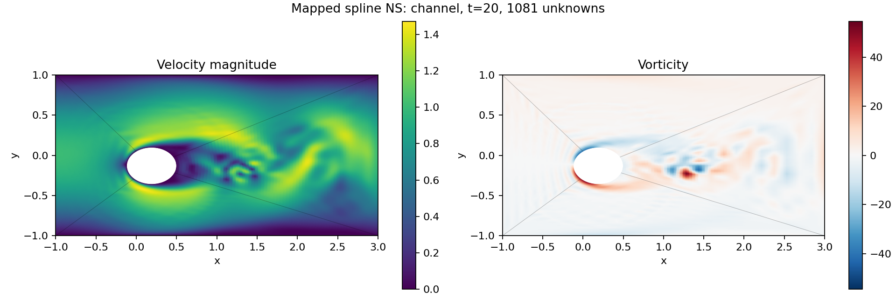

# Mapped divergence-conforming Navier–Stokes on GPU

This experiment extends [mapped spline Poisson](jax_mapped_spline_poisson.md)
to two-dimensional incompressible Navier–Stokes on the same rectangle minus
an eccentric ellipse. The implementation evolves velocity in a compatible
**divergence-free curl space**. Pressure is eliminated from the evolution;
this version does not reconstruct a pressure field.

- [Solver](../jax/src/bspf_jax/mapped_navier_stokes.py)
- [Manufactured solution and channel driver](../examples/pde/mapped_spline_flow.py)
- [Independent tests](../jax/tests/test_mapped_navier_stokes.py)

## Space, mapping and boundary conditions

For a scalar spline streamfunction `psi_hat` and each exact map `x=F(r,t)`,

```
psi = psi_hat composed with F^-1
u = (psi_y, -psi_x) = J/det(J) * (psi_hat_t, -psi_hat_r).
```

Thus this is the contravariant Piola image of the compatible reference curl.
With scalar tensor degree `(p,p)`, reference velocity has component degrees
`(p,p-1)` and `(p-1,p)`; divergence belongs to the associated `(p-1,p-1)`
pressure space and is zero identically for every state. Pressure drops out
when momentum is tested in this kernel. The method advances the full velocity
momentum weak form, including convection, rather than an independently fitted
vorticity transport equation.

The scalar trace is shared across patch seams, making normal velocity
continuous. Tangential velocity is generally discontinuous across seams.
An additional free streamfunction constant on the hole retains the circulation
mode of the multiply connected domain. The outer streamfunction correction is
zero; the hole correction is constant. This strongly imposes homogeneous
normal velocity for corrections without fixing the circulation artificially.

A static analytic streamfunction lift supplies prescribed physical boundary
velocity. Its curl is divergence-free everywhere. All four outer sides use
Dirichlet data in this first version. The channel example has parabolic inlet
**and prescribed parabolic outlet**, stationary upper/lower walls and a
stationary obstacle. It has no outlet buffer, sponge or open-outflow condition.
This is a different outlet condition from the previous rational BSPF run.

By default, tangential no-slip is also imposed exactly: the first two radial
coefficient rows share the hole constant, and the last two rows are zero. Open
spline endpoint identities then give zero radial derivative as well as a
constant trace. Consequently the full correction velocity vanishes on both
physical boundaries, while the hole constant remains a free unknown. This
strong option is specific to the two-dimensional curl-space construction.

`boundary="nitsche"` retains the weak tangential treatment for comparison. It
constrains only the endpoint coefficient rows and uses symmetric Nitsche terms.
Interior patch seams use symmetric interior penalty coupling in both modes. With `[u]=u_minus-u_plus`
and a shared normal from the minus patch to the plus patch, the unit-viscosity
bilinear form is

```
a(v,u) = sum_p integral grad(v):grad(u)
         - integral_interfaces ([v].{partial_n u} + {partial_n v}.[u])
         + integral_interfaces sigma [v].[u]
         - integral_walls (v.partial_n u + partial_n v.u)
         + integral_walls sigma v.u.
```

The code uses `sigma=8*(p+1)^2/h_n`, with `1/h_n = n_elements*|J^-T e_normal|`
and the larger inverse length on the two sides of a seam. This fixed geometric
penalty is multiplied by physical viscosity together with the entire form.
It is not an added bulk viscosity or a postprocessing filter. GPU Cholesky
checks that the assembled mass and viscous matrices are positive definite.
The strong option imposes boundary velocity to roundoff. In Nitsche mode,
finite-resolution tangential wall errors are measured and reported rather than
asserted to meet the old strongly imposed `1e-9` boundary criterion.

The compatible mapping and optional weak tangential boundary treatment follow
the foundation of [Evans–Hughes (2012)](https://www.ices.utexas.edu/media/reports/2012/1216.pdf).
The pressure-free kernel realization, exact boundary constraints and four-patch
interior coupling here are our implementation choices, not a reproduction of
every method in that paper.

## Convection and time stepping

Convection uses a skew volume form with central interface fluxes:

```
c(u;u,v) = 1/2 integral [v.(u.grad)u - u.(u.grad)v]
           + 1/2 integral_interfaces (u.n)*(v_minus.u_plus-v_plus.u_minus)
           + 1/2 integral_walls (u.n)*v.u.
```

Normal velocity is single-valued, so the interior flux is well defined. For
homogeneous impermeable boundaries, `c(u;u,u)=0` to roundoff, independently of
quadrature integration accuracy. Viscosity dissipates energy. These are
semidiscrete properties: the explicit convection time discretization still
requires an appropriate time step. Throughflow cases include boundary energy
transport and boundary work and need not have monotonically decreasing energy.

The second-order IMEX midpoint integrator treats viscous terms implicitly and
convection/body forces explicitly, with two solves against the same matrix
`M+dt*nu*K/2`. Both solves and a compiled multi-step loop reside on the GPU.
Forcing can be a JAX callable `forcing(xy,time)` returning a physical two-vector.
Manufactured forcing is derived from the continuous PDE, not from discrete
matrices.

## GPU implementation and API

This first NS prototype precomputes velocity and physical-gradient evaluation
matrices and dense reduced mass/viscous matrices **on the GPU**. It is not the
matrix-free Poisson implementation. Diagonal mass scaling improves coefficient
conditioning. Basis derivatives, geometry derivatives, Piola-equivalent curls,
interface assembly, lifting, Cholesky factorizations, nonlinear loads and time
stepping use GPU FP64 arrays. The host supplies only small knot/quadrature and
connectivity metadata and receives explicit diagnostics/output. No CPU solver
fallback is provided. Dense quadrature operators currently limit mesh scaling;
local tensor contractions are a future optimization.

```python
import jax
jax.config.update('jax_enable_x64', True)
from bspf_jax.immersed_poisson import EllipticHole
from bspf_jax.mapped_navier_stokes import (
    MappedNavierStokesPlan, channel_streamfunction,
)

bounds, hole = (-1., 3., -1., 1.), EllipticHole()
nu = (2/3)*(2*hole.axes[1])/200  # mean inlet speed times obstacle height / Re
plan = MappedNavierStokesPlan(
    elements=(16, 16), viscosity=nu, dt=.005, device=jax.devices('gpu')[0],
    lift=channel_streamfunction(bounds, hole),
)
state = plan.advance(plan.stokes_state, steps=4000)
stats = jax.device_get(plan.diagnostics(state))
```

`plan.project(velocity)` supplies an L2-projected initial condition. `advance`
returns a GPU state. `diagnostics` returns GPU scalar arrays, and `evaluate`
returns GPU fields on a tensor grid in every reference patch. Degree must be
at least two, viscosity and time step positive, and the plan requires an
explicit GPU and enabled FP64. Time-dependent boundary lifts and open outlets
are not implemented.

## Reproduction

On this A100 installation, use the existing CUDA library-loading workaround:

```sh
export LD_PRELOAD=/mpcdf/soft/SLE_15/packages/x86_64/cuda/13.0.1/lib64/libcublas.so.13
export OPENBLAS_NUM_THREADS=1 OMP_NUM_THREADS=1
export JAX_PLATFORM_NAME=gpu XLA_PYTHON_CLIENT_PREALLOCATE=false
export PYTHONPATH=jax/src:/tmp/pybspf-gpu-deps

python examples/pde/mapped_spline_flow.py --case mms --boundary strong --elements 4 8 12 \
  --time .1 --dt .002 --out build/mapped_spline_flow_mms_strong
python examples/pde/mapped_spline_flow.py --case channel --boundary strong --elements 16 \
  --reynolds 200 --time 20 --dt .005 --out build/mapped_spline_flow_re200_strong
python -m pytest jax/tests/test_mapped_navier_stokes.py jax/tests/test_mapped_poisson.py -q
```

The example writes numerical reports, raw fields and a plot. Fields are never
smoothed before export. Reported evolution times include periodic diagnostic
synchronization; initial JIT compilation is measured separately.

## Recorded validation

The no-slip manufactured solution has streamfunction
`psi=.05*(X*Y*q/64)^2*exp(-t)`, with `X=(x+1)*(3-x)`,
`Y=(y+1)*(1-y)` and `q=((x-.19)/.31)^2+((y+.13)/.23)^2-1`.
Velocity is its curl; pressure is zero. The body force is evaluated from the
continuous time derivative, convection and vector Laplacian using automatic
differentiation. Error integration uses seven Gauss points per span rather
than the six assembly points. All cases below end at `t=.1`, `dt=.002`.

| Elements per direction per patch | Unknowns | Relative velocity L2 error | Observed order | Warm ms/step |
| --- | ---: | ---: | ---: | ---: |
| 4 | 73 | 2.2218e-01 | — | 0.219 |
| 8 | 281 | 2.3456e-02 | 3.24 | 0.782 |
| 12 | 617 | 6.5799e-03 | 3.13 | 2.562 |

These are velocity orders; taking the curl reduces the degree and expected
L2 order by one relative to the scalar Poisson test. The Nitsche comparison
also converges at approximately third order. A temporal test evolves the same
nonlinear spatial system at successively smaller steps: errors decrease by
factors 4.05 and 4.20 when the step is halved, confirming second-order time
accuracy independently of spatial error.

An exact steady-strain case `u=(x,-y)`, `p=-(x*x+y*y)/2` checks nonzero boundary
lifting and pressure-gradient cancellation. Quadrature must resolve the curved
map: increasing points per span from 9 to 12 to 15 reduces the Nitsche lift
balance residual from `8.94e-8` to `1.46e-10` to `2.35e-13`, and the pressure
load from `1.26e-9` to `1.82e-12` to `9.36e-15`. The tight exact-balance regression
therefore uses 15 points. Pointwise divergence is an algebraic property; exact
integration of pressure loads is still subject to quadrature accuracy.

### Re=200 channel run

The exact-wall run uses 16×16 elements per patch, cubic streamfunctions, 1,081
unknowns, peak inlet speed 1, mean inlet speed 2/3, obstacle height .46 and
`nu=.0015333333333333332`. It starts from the discrete Stokes solution.

| Measurement at t=20, dt=.005 | Result |
| --- | ---: |
| Steps | 4,000 |
| Evolution, including diagnostic synchronization | 24.14 s |
| Average warm step | 6.04 ms |
| Initial setup, including JIT | 20.43 s |
| First compiled batch of 50 steps | 1.50 s |
| Maximum divergence at quadrature points | 2.64e-13 |
| Maximum boundary velocity error | 4.84e-16 |
| Maximum normal jump across patch seams | 3.78e-15 |
| Integrated tangential seam jump L2 | 3.65e-2 |
| Inlet / outlet volume flux magnitude | 1.3333333333333335 |
| Net boundary flux | 2.90e-17 |

The setup totals break into geometry/basis construction (8.34 s), dense
operator assembly (10.92 s) and factorization (1.17 s). These include JIT and
are not pure compiler-time measurements. The implementation has not yet been
optimized for setup latency or large-grid memory scaling.

A control run at `dt=.0025` (8,000 steps, 48.27 s) changes final velocity by
0.436% and vorticity by 1.789% in determinant-weighted L2 on the shared
65×97 reference grid per patch. Maximum sampled component differences are
.0382 for velocity and 1.24 for vorticity. This is a time-step sensitivity
check, not a spatial convergence claim for the Re=200 wake.

The retained Nitsche comparison at the same mesh and Reynolds number has
maximum boundary error .117 at t=20, with about .083 obstacle slip on the
output grid. The exact-wall option removes this boundary error algebraically;
it does not remove all spatial truncation error. Tangential seam jumps remain,
and a refined-grid wake/outlet study is still required. The mapped solver has
not yet established that the original rational BSPF ripple problem is fixed.



Recorded artifacts:

- [Exact-wall MMS](data/mapped_navier_stokes/mms_strong.json)
- [Nitsche MMS](data/mapped_navier_stokes/mms_nitsche.json)
- [Exact-wall Re=200](data/mapped_navier_stokes/re200_strong.json)
- [Nitsche Re=200 comparison](data/mapped_navier_stokes/re200_nitsche.json)
- [Half-step Re=200](data/mapped_navier_stokes/re200_strong_half_dt.json)
- [Time-step comparison](data/mapped_navier_stokes/time_control.json)
- [Quadrature balance audit](data/mapped_navier_stokes/quadrature_balance.json)

The regression suite covers first/second spline derivatives against SciPy,
Piola equivalence, physical velocity gradients against finite differences,
normal continuity, the free obstacle constant, exact no-slip constraints,
positive viscous energy, zero convective work for a closed domain, GPU transfer
guards through forced time stepping, continuous NS convergence in both wall
modes, temporal order and nonzero-boundary pressure balance. It also reruns the
mapped Poisson tests.

Final GPU validation: **19 tests passed in 209.64 s** on the A100.


### MP4 rendering

Using the same GPU environment as above:

```sh
python examples/pde/render_mapped_spline_flow.py \
  --run-dir build/mapped_spline_flow_re200_strong
```

This re-evolves the recorded channel configuration on GPU and writes
`flow.mp4`, `flow.states.npz`, `flow.preview.png` and `flow.video.json` inside
the run directory. The default video samples every .05 simulation units,
including t=0 and t=20, at 20 fps and 1600×560 pixels. Velocity magnitude and
vorticity appear side by side with fixed colour scales. Vorticity colours
saturate outside ±30 (adjustable with `--vorticity-limit`); the numerical fields
are not filtered. The sidecar records agreement with the saved final state.

### Ripple cause audit

The [follow-up investigation](jax_mapped_ripple_investigation.md) isolates
initial Stokes vorticity defects, radial near-grid-scale waves, centered
transport limitations and lift regularity using GPU controls. Divergence
conformity and exact wall velocity do not by themselves prevent these
vorticity errors. The audit does not change the production solver.
