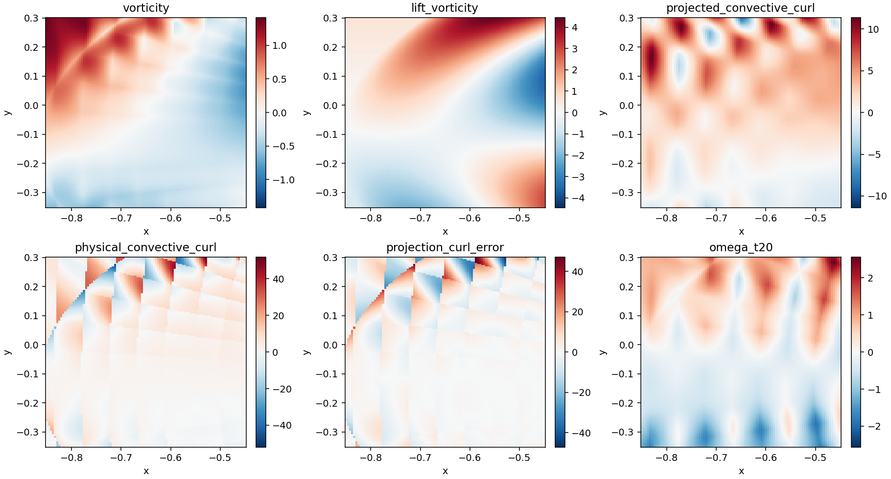
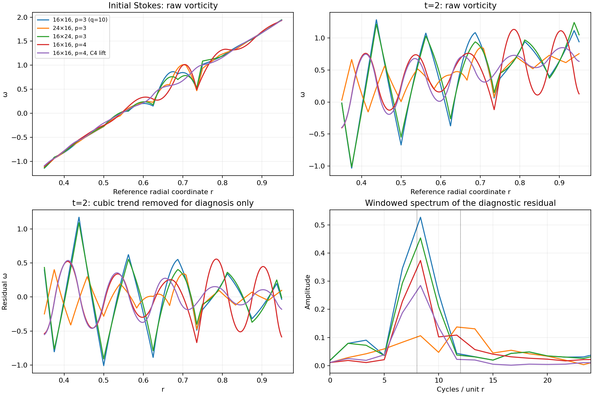
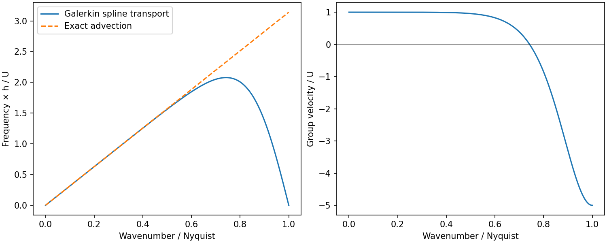
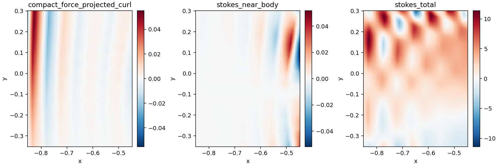

# Cause audit: mapped Re=200 vorticity ripples

The strongest evidence identifies an **under-resolved radial spline mode**, with
roughly a two-element wavelength, rather than a failure of incompressibility or
GPU linear algebra. Vorticity defects already exist in the discrete Stokes
initial condition. Centered transport represents derivatives of near-grid-scale
modes poorly, providing a mechanism for the subsequent oscillations. The lift's
limited smoothness introduces an additional vorticity kink; it does not explain
the entire ripple.

This is a diagnosis, not a completed remedy. The production solver and its
parameters were not changed. All PDE assembly, solves and independent field
evaluations below ran in FP64 on the A100 GPU. Saved-output statistics and plots
were computed on the host.

## Configuration and independent observations

The baseline is the [mapped channel experiment](jax_mapped_navier_stokes.md):
Re=200, nu=0.0015333333333333332, cubic scalar splines, 16×16 elements per patch,
1,081 unknowns, exact normal and tangential boundary velocity, dt=.005. The
initial state solves discrete Stokes with the same boundary lift. The channel
has prescribed parabolic inlet and outlet, not an open outlet.

A physical Cartesian probe covers x=[-.85,-.45], y=[-.35,.30], with 97×161
samples, entirely inside the left patch and away from walls and seams. An
independent evaluator inverts the physical ray map and differentiates the
scalar streamfunction directly. It does not use the production velocity or
gradient matrices. Its baseline velocity and vorticity agree with the
production evaluator to about 1e-15 and 3e-14, respectively. Thus the bands are
in the numerical field, not introduced by MP4 rasterization or patch plotting.

At t=0, the discrete Stokes residual divided by the convective load is 6.4e-12.
The frozen convective mass solve has relative residual 3.95e-15. The previous
full run had maximum divergence 2.64e-13 and boundary velocity error 4.84e-16.
These checks establish algebraic accuracy; they do not establish spatial
accuracy of vorticity.



Each panel uses its own colour range. D4 below denotes RMS **unscaled fourth
sample differences** on the fixed Cartesian probe. It measures roughness, not
PDE error, and is sensitive to continuity at knots and the lift cutoff.

## The initial Stokes field is already inaccurate in the interior

For unforced constant-viscosity Stokes flow, taking the curl gives
`Delta omega = 0` in the interior. Consequently vorticity equals its average on
any circle whose disk lies in the fluid. This supplies an independent test
without a reference solution and without taking high derivatives through
spline knots.

We used 17×17 circle centers in x=[-.8,-.5], y=[-.25,.2], and radii .025, .05
and .075. Every disk stays inside the left patch. At radius .05, the baseline
RMS center-minus-circle-average defect is **.0781**, versus **1.60e-5** change
when increasing angular samples from 128 to 256. The sampled center vorticity
RMS is .348. Increasing assembly quadrature from 6 to 10 points per span leaves
the defect unchanged to the displayed precision.

This is a necessary-condition test of Stokes accuracy, not a norm of error
against an exact solution. The defect cannot be attributed to the circle
integration error at this size. Independent reconstruction of all seven saved
Stokes fields agrees within 6.22e-15. Analytic harmonic and non-harmonic circle
tests also pass. See [circle reports](data/mapped_ripple/mean_value.json).

## The ripple wavelength follows the radial mesh

Compare a fixed physical ray in the left patch, tangent coordinate .35, radial
coordinate r=[.35,.95], at t=2. The ray is sampled at 2,049 points. A cubic trend
is removed only to diagnose the spectrum; the solver and exported fields are
not filtered. A Hann window is used for the Fourier diagnostic. The finite
interval gives frequency bins about 1.67 cycles per unit r apart.

| Control | Unknowns | Dominant cycles / r | Detrended line RMS | Cartesian D4x at t=2 |
| --- | ---: | ---: | ---: | ---: |
| 16×16, p=3, quadrature 10 | 1,081 | 8.33 | .415 | .08842 |
| Radial refinement: 24×16 | 1,657 | 11.66 | .153 | .05688 |
| Tangential refinement: 16×24 | 1,561 | 8.33 | .378 | .08564 |
| 16×16, p=4 | 1,217 | 8.33 | .326 | .02259 |
| 16×16, p=4, C4 lift | 1,217 | 8.33 | .241 | .00629 |

The expected radial coefficient Nyquist frequencies are 8 and 12 for 16 and
24 elements. The measured peaks are consistent with those frequencies to the
spectral resolution. Tangential refinement does not shift the peak. Radial
refinement reduces this line residual by about 63%, but moves the oscillation
to a smaller wavelength. This is strong evidence for a radial discretization
artifact. A detrended line RMS still contains non-oscillatory approximation
error and is not an exact ripple-amplitude norm.

The line comparison uses the quadrature-10 baseline because its saved output
includes the native ray. Its Cartesian D4x differs from the quadrature-6
baseline by only 0.00081% at t=2. Default quadrature is p+3 points per span.
These are directional controls, not a resolution-converged wake study.



## Why divergence conformity does not prevent this mode

Divergence conformity constrains `div u`; the visible quantity is
`omega = curl u`. It does not enforce a maximum principle, bounded vorticity,
or correct transport of modes near the grid cutoff.

Two isolated GPU experiments establish the transport limitation:

1. **Uniform periodic analogue.** Quadratic velocity splines correspond to the
   derivative of cubic streamfunctions along a uniform coordinate. For centered
   Galerkin advection, the dimensionless frequency is

   ```text
   omega_h h/U = [(5/6) sin(theta) + (1/12) sin(2 theta)]
                 / [11/20 + (13/30) cos(theta) + (1/60) cos(2 theta)].
   ```

   The GPU-assembled symbol agrees with this closed form within 2.22e-15.
   Long waves have nearly exact speed. Group velocity reverses beyond about
   .743 of Nyquist; the alternating coefficient mode at Nyquist has zero
   advective frequency. This centered operator is dispersive despite its
   energy property. Physical viscosity still damps these modes; zero advective
   frequency does not mean zero damping.

2. **Actual mapped space.** Construct compact divergence-free velocity modes
   supported away from all boundaries and seams. Project their exact physical
   x derivative into the production space using the GPU mass matrix. The
   derivative is itself divergence-free and zero near the boundaries, so its
   continuous incompressible projection is itself. At 1/8 of radial coefficient
   Nyquist, relative projection error is **4.90%**. At 3/4 it is **64.2%**; at
   Nyquist it is **88.5%**, with only **46.6%** of the derivative's L2 norm
   retained. This experiment has no background lift, nonlinear aliasing or
   convective seam flux.

The periodic test is an illustrative local model: its group velocities are
not measured eigenvalues of the full curved, viscous channel operator. The
mapped test measures derivative representation, not group velocity. Together
with the mesh-following wavelength, they support poor short-wave transport as
a persistence mechanism. They do not yet constitute a complete mode-by-mode
budget of the nonlinear run.



[Transport measurements](data/mapped_ripple/transport.json).

## The boundary lift sets a separate smoothness limitation

The production lift uses a clipped quintic smoothstep in elliptical radius.
The scalar lift is C2 at its outer cutoff, velocity C1 and vorticity C0. Cubic
streamfunction splines likewise produce only C0 vorticity at simple interior
knots. Sharp vorticity slope changes are therefore expected at finite
resolution even when velocity looks smooth.

An experimental ninth-degree smoothstep makes the scalar lift C4 while keeping
the same physical boundary data and cutoff radius. With p=3 alone, this changes
the t=2 Cartesian D4x by only -1.6% and line RMS from .415 to .398. It does not
remove the ripple.

With p=4, the original lift leaves a D4 floor close to the lift's own D4. The
combined p=4/C4 control lowers the initial Stokes mean-value defect from .0781
to .0173 and t=2 D4x from .0884 to .00629. However, the line residual falls only
to .241, and its dominant frequency stays near radial Nyquist. **A 93% drop in
D4 is not a 93% reduction of ripple amplitude.** Greater continuity removes
kinks much more effectively than it removes the remaining wave.

The lift controls change the finite-dimensional affine approximation space,
although the continuous PDE and boundary data stay the same. Their effect is
therefore evidence of approximation sensitivity, not a changed physical flow.

## Mass projection can spread curl error, but is not the whole source

For a compact interior test streamfunction phi, projecting a physical force F
into a curl space gives, locally,

```text
integral grad(phi).grad(psi_dot_h) = integral phi curl(F).
```

Thus `-Delta psi_dot_h`, the returned vorticity rate, matches the force curl in
a weak sense. It need not match it pointwise. A local spline basis still has a
global inverse mass matrix; locality and exact divergence do not make the
projection commute pointwise with curl.

A unit-L2 smooth compact force was placed at x=[0,.4], y=[.35,.55], entirely
outside the upstream probe. Its force and exact curl are zero throughout the
probe. Nevertheless, the strong-wall discrete projection produces upstream
vorticity-rate RMS **.00973**, max **.0553**, with mass residual **7.47e-16**.
The normal-only/Nitsche comparison gives RMS **.000299**, about 32.5 times
smaller. Exact tangential constraints amplify this particular leakage; they
are not its sole cause. The previous Nitsche channel also had ripples and
appreciable wall slip, so this is not a recommendation to revert the walls.

For the actual frozen convective load, partitioning force near the body
(elliptical radius q<2, hence zero in the probe) gives a more limited conclusion:

- At Stokes startup, its projected upstream vorticity-rate RMS is .00673
  versus total 3.134. Its D4x norm is only .46% of the total, with correlation
  .025. Remote near-body convection is **not the dominant startup source**.
- At t=20, near-body RMS is .385 versus total 1.758; its D4x norm is 17.0% of
  total, with correlation .737. It contributes later, but this norm ratio is
  not an additive percentage of the error.

The direct strong-form convective seam contribution at startup is also small
in the probe: RMS .00353 compared with bulk 3.135. This does not exclude
viscous seam coupling or global boundary/outlet effects.

Finally, the current mapped result differs from the earlier rational BSPF
case: the raw initial physical convective curl has D4x 21.0 while its projected
value has D4x .300. Here projection **smooths** the already rough raw source;
it does not exhibit the earlier 314-fold roughness amplification of a smooth
source. The raw source uses third derivatives of a C2 streamfunction and has
jumps at knots, so large sample differences are unsurprising.



[Strong-wall projection](data/mapped_ripple/projection_strong.json),
[Nitsche projection](data/mapped_ripple/projection_nitsche.json).

## What the evidence resolves and leaves open

The upstream bands are present before convection starts, violate an interior
Stokes identity, and subsequently develop a wavelength tied to the radial
mesh. A smoother lift reduces one source of error; the approximation and
centered transport still support near-cutoff oscillations. This explains why
changing the divergence treatment alone did not eliminate the symptom.

GPU solve error, video rendering, boundary velocity mismatch and insufficient
assembly quadrature do not explain the observed upstream pattern at the
measured sizes. The earlier half-step run changed final vorticity by 1.79%,
which supports spatial error as the larger concern but does not establish
complete temporal convergence.

This audit does not isolate every contribution from the viscous seam operator,
wall layer, prescribed outlet or downstream wake. It does not prove that a
particular stabilization will eliminate all oscillations. Any remedy should
be assessed using both the Stokes interior check and unfiltered vorticity
amplitude, alongside incompressibility and boundary constraints. D4 alone is
insufficient.

## Reproduction and artifacts

Diagnostics live in [examples/pde/mapped_diagnostics](../examples/pde/mapped_diagnostics/).
Raw arrays stay under `build/mapped_ripple`; compact reports and figures are
preserved under [data/mapped_ripple](data/mapped_ripple/). The
[comparison report](data/mapped_ripple/comparison.json) includes independent
symbol, circle and field-reconstruction checks.

From the repository root, with the existing GPU Python environment:

```sh
module load cuda/13.0 cudnn/9.13.0
export LD_PRELOAD=/mpcdf/soft/SLE_15/packages/x86_64/cuda/13.0.1/lib64/libcublas.so.13
export OPENBLAS_NUM_THREADS=1 OMP_NUM_THREADS=1
export JAX_PLATFORM_NAME=gpu XLA_PYTHON_CLIENT_PREALLOCATE=false
export PYTHONPATH=jax/src:/tmp/pybspf-gpu-deps
gpu_python=/u/limo/venvs/numba_cuda_waterboa/bin/python

"$gpu_python" examples/pde/mapped_diagnostics/source_audit.py --evolve 2 \
  --history build/mapped_spline_flow_re200_strong/flow.states.npz
"$gpu_python" examples/pde/mapped_diagnostics/source_audit.py --quadrature 10 --evolve 2 \
  --out build/mapped_ripple/quadrature10
"$gpu_python" examples/pde/mapped_diagnostics/run_controls.py
"$gpu_python" examples/pde/mapped_diagnostics/run_projection_controls.py
"$gpu_python" examples/pde/mapped_diagnostics/transport_audit.py
"$gpu_python" examples/pde/mapped_diagnostics/summarize.py
```

The history-dependent diagnostics use the channel state history produced by
`render_mapped_spline_flow.py`; projection localization reads the t=20 coefficients in the channel driver
output `build/mapped_spline_flow_re200_strong/solution.npz`. Run GPU cases sequentially because their dense quadrature operators
consume substantial device memory. No production regression rerun was needed
for this diagnostic-only addition; the previous 19-test result belongs to the
solver implementation, not to this new investigation.
