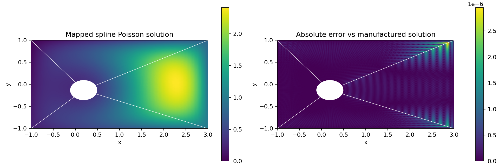

# Mapped spline Poisson on GPU

The `experiment/mapped-divergence-conforming-splines` branch starts with a
scalar Dirichlet Poisson problem on the physical obstacle-flow domain,
`[-1,3] × [-1,1]` minus the ellipse centered at `(0.19,-0.13)` with axes
`(0.31,0.23)`. There is no outlet buffer in this test. The prototype uses local
cubic B-splines and four exact geometry maps. It validates the scalar H1
mapping and assembly foundation for the proposed compatible-space experiment.

Implementation: [mapped_poisson.py](../jax/src/bspf_jax/mapped_poisson.py).
Runnable convergence study: [mapped_spline_poisson.py](../examples/pde/mapped_spline_poisson.py).

## Geometry and discretization

Each patch joins one side of the rectangle to an ellipse arc. Let `c` be the
ellipse center, `a,b` its axes, and `v(t)` traverse one rectangle side in
counterclockwise order. For reference coordinates `r,t` in `[0,1]`, define

```
d(t) = v(t) - c
rho(t) = 1 / sqrt((d_x/a)^2 + (d_y/b)^2)
F(r,t) = c + [rho(t) + r*(1-rho(t))] d(t).
```

`r=0` is the exact ellipse and `r=1` the straight outer boundary. The geometry
is analytic, independent of the solution basis; there is no fitted NURBS
geometry or rational boundary correction. All four Jacobians have positive
determinants for an ellipse strictly inside the rectangle.

Open tensor B-splines are pulled back through these maps. Shared coefficients
on adjacent patch edges impose C0 continuity. Within each patch cubic splines
are C2. Write `u=g+w`, where the prescribed Dirichlet lift `g(x,y)` is defined
throughout the fluid and `w` has zero boundary coefficients. Solve

```
integral grad(v) . grad(w) = integral v*f - integral grad(v) . grad(g).
```

The pulled-back stiffness metric is `det(J) J^-1 J^-T`. Tensor contractions
apply the stiffness without constructing a global matrix. A GPU Jacobi
preconditioner and conjugate gradients solve the symmetric positive definite
system; the implementation checks the true residual after iteration and
raises on nonconvergence. Five Gauss points per knot span assemble cubic
operators. Seven points per span independently integrate reported errors.

Knot vectors, Gauss nodes/weights and connectivity are small host metadata.
B-spline evaluation, geometry/Jacobians, load assembly, metric tensors,
preconditioner, operator application and the entire PCG loop run on the GPU
in FP64. Only scalar diagnostics return during a solve. Plotting and saving
explicitly download output fields. No CPU linear solve is used by the
implementation; a tiny CPU matrix is used only as an independent test oracle.

## Reproduction

Enable an FP64-capable JAX GPU installation. On the current A100 machine:

```sh
LD_PRELOAD=/mpcdf/soft/SLE_15/packages/x86_64/cuda/13.0.1/lib64/libcublas.so.13 \
OPENBLAS_NUM_THREADS=1 OMP_NUM_THREADS=1 \
JAX_PLATFORM_NAME=gpu XLA_PYTHON_CLIENT_PREALLOCATE=false \
PYTHONPATH=jax/src:/tmp/pybspf-gpu-deps \
python examples/pde/mapped_spline_poisson.py --elements 4 8 16 32
```

The preload is this environment's existing CUDA library-loading workaround;
the new solver does not call cuSOLVER. The same environment prefix with
`python -m pytest jax/tests/test_mapped_poisson.py -q` runs its tests.

The example writes `report.json`, `solution.npz` and `solution.png` under
`build/mapped_spline_poisson/`. The plan requires an explicit GPU device and
`jax.config.update('jax_enable_x64', True)`. Example use:

```python
from bspf_jax.mapped_poisson import MappedPoissonPlan

plan = MappedPoissonPlan(elements=(16, 16), device=jax.devices('gpu')[0])
solution = plan.solve(lambda xy: 1. + 0.*xy[0])  # zero Dirichlet data
```

Optional `lift=` must be a differentiable JAX scalar function on the entire
fluid domain whose boundary values are the desired Dirichlet data.

## Validation on A100

The manufactured solution is `u = X*Y*q/64 + g`, with
`X=(x+1)*(3-x)`, `Y=(y+1)*(1-y)`,
`q=((x-.19)/.31)^2+((y+.13)/.23)^2-1` and `g=.3+.2*x-.1*y`.
Its forcing and gradient are derived analytically, independently of the
stiffness implementation. Thus both outer and obstacle boundary data are
nonzero, and the physical field cannot be exactly represented by these mapped
cubic spline spaces.

| Elements per direction per patch | Unknowns | Relative L2 error | L2 order | H1 seminorm order | Warm solve |
| --- | ---: | ---: | ---: | ---: | ---: |
| 4 | 120 | 8.323e-04 | — | — | 6.29 ms |
| 8 | 360 | 5.595e-05 | 3.89 | 2.93 | 8.37 ms |
| 16 | 1,224 | 3.795e-06 | 3.88 | 2.91 | 13.44 ms |
| 32 | 4,488 | 2.476e-07 | 3.94 | 2.95 | 22.44 ms |

Warm times are the median of three repeated solves from zero, including load
assembly, PCG and synchronization, with the same source/lift callables and an
existing plan. Each different resolution has new JIT shapes. Initial plan
construction takes 2.89–3.10 s; its first solve takes 1.41–1.64 s including
compilation. These are whole-operation times, not a compiler-time decomposition.
Warm solves take 80, 112, 164 and 258 iterations respectively. This initial
prototype still uses dense one-dimensional basis tables; larger-grid scaling
and stronger preconditioners have not been optimized.

At 4,488 unknowns, the true relative algebraic residual is `8.94e-12`, maximum
sampled field error is `3.38e-6`, maximum boundary error is `5.55e-16`, and
maximum patch value jump is `1.11e-16`. The area agrees with
`8-pi*.31*.23 = 7.776004443799...`. The solution converges at the expected
fourth order in L2 and third order in the gradient seminorm.

Eight tests passed in 58.09 s on GPU. They cover independent SciPy basis values
and derivatives through degree four including knots/endpoints; exact boundary
and seam geometry; Jacobians checked by finite differences; stiffness, load,
diagonal and PCG against a separately assembled dense reference; transfer-guard
checks excluding implicit host/device transfers in numerical kernels;
manufactured convergence; zero loads; and failure on insufficient iterations.

[Recorded results](data/mapped_spline_poisson/report.json)



## Scope of this experiment

This is scalar H1 Poisson, not yet the full mapped H(div) velocity-pressure
method in [Evans–Hughes (2012)](https://www.ices.utexas.edu/media/reports/2012/1216.pdf).
The companion [mapped Navier–Stokes prototype](jax_mapped_navier_stokes.md)
now implements compatible curl velocities, viscous interface coupling and GPU
flow time integration. This Poisson study validates only its scalar foundation.
The paper's velocity boundary treatment strongly imposes normal velocity and
weakly imposes tangential no-slip; the strong scalar Dirichlet treatment here
does not substitute for that construction.

The error plot still has small cell-scale discretization structure, decreasing
at the measured refinement rates. A successful smooth Poisson test does not
establish a discrete maximum principle or eliminate the Re=200 convection
projection ripples. No artificial viscosity, smoothing or output filter is
applied in this prototype.
