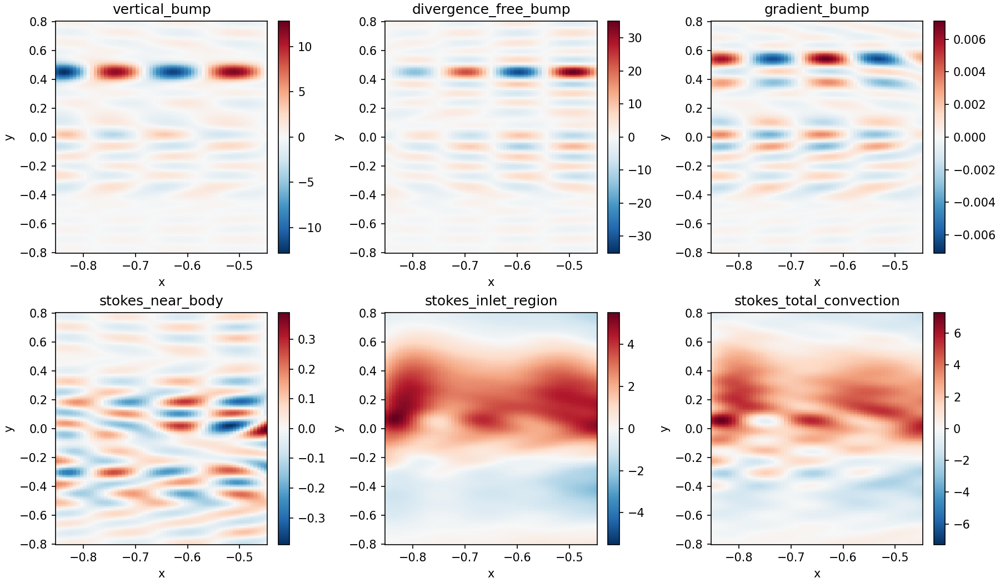

# Re=200 obstacle-flow ripple investigation

Status: unresolved; the persistent investigation goal remains active. No output
filter, extra viscosity, or altered convection formula has been introduced.

The reference case uses the eccentric ellipse, physical channel [-1,3]×[-1,1],
a two-unit outlet buffer, sponge strength 3, rational wall correction, and
viscosity 0.0015333333333333333. All reported evolutions run on an A100 GPU.
Pole preprocessing remains disabled.

## Controls completed

The 73×33 reference was run to t=20. Halving dt from .02 to .01 changes final
physical-region velocity by 0.858% in relative grid L2, but leaves the observed
ripple pattern nearly unchanged. Increasing the quadrature factor from 2.5 to
4 at dt=.01 changes final vorticity by only 0.0339% relative. Replacing FP64 BSPF
evaluation by the 113-bit MPFR reference changes final vorticity by 1.13e-7
relative. These controls do not explain the artifact at this resolution.

The raw fourth-difference diagnostic below measures variation in y on the same
401×161 output grid, in x∈(-.85,-.45), y∈(-.8,.8). Values are RMS averaged over
t=10…20. It cancels a smooth cubic trend; it is neither an exact physical error
norm nor a filter applied to the solver. It weights finer oscillations more
strongly and must be read together with the raw field plots and boundary tests.

| Grid | dt | Quadrature factor | Basis arithmetic | Upstream diagnostic |
| --- | --- | --- | --- | --- |
| 73×33 | .02 | 2.5 | FP64 | .0066350 |
| 73×33 | .01 | 2.5 | FP64 | .0066231 |
| 73×33 | .01 | 4 | FP64 | .0066229 |
| 73×33 | .01 | 2.5 | MPFR | .0066231 |
| 73×65 | .01 | 2.5 | FP64 | .0849983 |
| 145×33 | .01 | 2.5 | FP64 | .0023806 |
| 97×65 | .01 | 2.5 | FP64 | .0439161 |

Wall-normal refinement reduces the broad bands away from the wake but leaves
finer upstream oscillations. Streamwise refinement reduces the upstream metric.
Refinement is not yet a validated fix: independent final hole/outer-wall velocity
errors are respectively 1.25e-7/4.51e-9 (73×65), 6.81e-9/8.86e-9 (145×33), and
3.08e-7/5.10e-8 (97×65), exceeding the existing 1e-9 criterion. The 97×65 flux
error is 1.15e-9 and its retained energy condition number is 9.25e10. A separate 97×65 MPFR control at t=2 changes vorticity by only 3.99e-7
relative to FP64 at the same time. Its hole/outer-wall errors remain
3.95e-7/5.10e-8: the refined-grid boundary failure also survives high-precision
BSPF evaluation. A direct boundary-fit audit separates trace compression from
rational approximation errors.

## Independent convection audit

On the q=4, 73×33 final state, the advective load and equivalent rotational load
(including the outlet kinetic-head boundary term) agree to 3.45e-8 relative in
the mass-dual norm. Convective bulk power differs from the inlet/outlet kinetic
energy flux by 1.12e-10. This does not support changing the convection formula
as a remedy for the observed ripples.

The audit reconstructs the state from original BSPF coefficients, so the result
is invariant to eigenvector sign/rotation changes during setup. Script: `examples/pde/re200_diagnostics/weak_form_audit.py`; recorded numbers:
`docs/data/re200_ripple/weak_form_audit.json`.

## Source audit: where the ripple enters

The solver was then frozen and audited **before any time step**. In an upstream
fluid patch x∈[-.85,-.35], y∈[-.8,.8], compare the discrete vorticity derivative
with the local pressure-free equation

    omega_t = -u*omega_x - v*omega_y + nu*(omega_xx + omega_yy).

There is no sponge force in this patch. Spatial derivatives in the independent
PDE check use fourth-order centered differences with h=.002 and .001. At the
initial Stokes state, the measured residual changes by less than 1e-9 RMS when h
is halved. At t=20 the two estimates differ by about 6e-6 on an RMS residual of
6.12. Thus the diagnostic differentiation does not explain the oscillations.

The initial state has balanced linear loads: the viscous+sponge residual is
8.14e-19 relative to the total discrete acceleration load. Its new acceleration
therefore comes from the mass projection of the nonlinear force. The GPU mass
solve has relative backward residual 5.79e-16. Independent direct reconstruction
at volume quadrature points agrees with resident fields to 2.08e-11 relative
(maximum absolute difference 5.08e-10, checked on the final state).

The local PDE's initial vorticity rate is smooth. The projected rate contains
oscillations whose fourth-difference RMS is **314 times** that of the PDE rate.
After one dt=.01 step, the high-frequency error has correlation **0.986** with
this initial spatial error. It is introduced before temporal integration and
then inherited by the solution.

Directional controls hold the initial physical field and PDE forcing essentially
fixed, and change only the spatial approximation:

| BSPF nodes | Initial local residual RMS | Fourth-difference RMS | Ripple peak, cycles/unit y |
| --- | --- | --- | --- |
| 73×33 | .66967 | .010946 | 7.01 |
| 145×33 | .48838 | .0041054 | 7.01 |
| 73×65 | .97488 | .20541 | 14.01 |

The peak above is the spectrum of the fourth-difference residual, not the
largest peak of the entire residual, which also contains low frequencies. The
nominal uniform Fourier cutoffs are respectively 8 and 16 cycles/unit y.
Doubling y resolution doubles the ripple frequency; increasing x resolution
reduces the ripple measure by 2.67×. The y fourth-difference measure itself
penalizes higher frequencies more strongly, so its increase must not be read as
a corresponding factor increase in vorticity amplitude.

This locates the entry mechanism: **spatial projection ringing in the globally
supported BSPF+rational velocity space**. A continuous pressure correction is a
gradient and has zero interior curl; the finite velocity projection here does
not reproduce the local curl of the force. Energy balance and divergence-free
velocity alone do not ensure accuracy of that curl. This initial-state audit alone does not distinguish startup boundary
compatibility from a persistent representation error. The subsequent controls
below address that distinction and the role of rational approximation accuracy.
No numerical remedy is inferred from the initial-state audit alone.

A subsequent isolated control keeps 73×65 BSPF nodes and the physical problem
fixed, and increases the rational polynomial/Laurent orders from 96/64 to
128/96, with 800→1200 boundary samples. The initial ripple measure changes by
only 4.47e-7 relative; its local PDE residual RMS remains .97488. The geometry
approximation accuracy is therefore not the dominant source of this initial
ringing. This does not test changing the mathematical corrected-space
construction itself. The control takes no time steps and is not a proposed fix.

A separate causal control replaces the abrupt convection startup by a smooth
function flat to all orders at t=0 and t=2. It uses exactly the original equations
and time-step kernel after t=2 (one-step parity error is zero). The late-time
upstream ripple metric averaged over t=10…20 is .00658949, versus .00662313 for
the original startup: a difference of only **0.51%**. Thus the persistent ripple
is not merely an initial compatibility transient. This is a diagnostic change
to the startup equations, not a proposed production remedy. The continuously
forced spatial projection remains the supported entry mechanism.

The same spatial grid at Re=20 already has a small upstream ripple (final
fourth-difference RMS .0005966 versus .0067594 at Re=200). Lower viscous damping
is a plausible reason it is more visible at higher Re, not an independently
proved scaling law.

Reproduction: `source_audit.py`, `initial_projection_audit.py`, and
`plot_source_audit.py` in `examples/pde/re200_diagnostics`. They use the
unchanged production spatial and time operators. Generated arrays and reports go under
`build/immersed_flow/re200_ripple_study`. Compact reports and diagnostic figures
are preserved in `docs/data/re200_ripple`.

## GPU memory correction enabling refinement

The original 97×65 attempt exhausted GPU memory while assembling dense volume
operators. Merely donating the scaled operator buffers did not suffice: fused
tensor construction and Gram products also requested large simultaneous scratch
allocations. `_immersed_assembly.py` now processes large tensor operators, Gram
contributions, and normalized operators sequentially. Scaling consumes input
buffers. The Galerkin formulas are unchanged; small plans retain fused kernels
when total operator storage is at most two GiB. This is a scheduling threshold,
not a numerical parameter.

The 97×65 run subsequently completed all 2000 GPU steps with 5787 retained modes
and 47838 quadrature points. Setup took 62.98 s on the measured run. This is an
assembly-memory correction, not a claimed ripple fix. Independent tensor and
energy-form checks cover both the fused and sequential schedules.

## Reproduction and artifacts

GPU runs in this environment require the matching cuBLAS preload:

```bash
LD_PRELOAD=/mpcdf/soft/SLE_15/packages/x86_64/cuda/13.0.1/lib64/libcublas.so.13 \
OPENBLAS_NUM_THREADS=1 OMP_NUM_THREADS=1 JAX_PLATFORM_NAME=gpu \
XLA_PYTHON_CLIENT_PREALLOCATE=false PYTHONPATH=jax/src:/tmp/pybspf-gpu-deps \
python examples/pde/immersed_channel_flow.py \
  --backend gpu --wall-method rational --basis-precision float64 \
  --no-rational-preprocessing --re 200 --nx 97 --ny 65 \
  --dt .01 --time 20 --out build/immersed_flow/re200_gpu_97x65
```

Control run directories are under `build/immersed_flow/re200_gpu*`. Each completed
run contains the raw fields, history, summary, and independent boundary/flux
checks. `re200_ripple_study` contains comparison plots, regional diagnostics,
precision comparisons, and the weak-form audit. All plots use unsmoothed fields.

The evidence localizes the persistent artifact to cutoff-scale ringing in the
spatial projection of nonlinear forcing. The startup and rational-order controls
do not remove it. Further analysis should locate the responsible modes and
forcing regions within the corrected global approximation space; a validated
remedy has not yet been established.

Regression verification after the assembly-memory correction: 34 passed, 1 skipped
(`test_gpu_volume`, `test_immersed_flow_gpu`, and `test_hybrid_flow`), including
manufactured-solution accuracy, wall/flux checks, and GPU/CPU operator parity.

## Return to BSPF: force localization and projection controls

Following the mapped-spline comparison, active correction work is again focused
on the **BSPF NS solver**. Similar ripples in different bases motivate testing
the common projection/formulation, rather than another basis replacement.
This is a working hypothesis about the mechanism, not a claim that the basis
has no influence. The spline and BSPF runs also have different outlet treatment.

The new `projection_localization.py` uses the original 73×33 corrected BSPF
space, Re=200, GPU FP64 evaluation and GPU force/mass solves. It does not change
production equations. Its upstream probe is x=[-.85,-.45], y=[-.8,.8], sampled
at 61×161 points; note the slightly shorter x extent than the earlier source
audit. All D4 values in this section use this fixed probe.

### A divergence-free compact force still produces remote curl error

A polynomial bump has support x=[0,.4], y=[.35,.55], disjoint from the probe.
Three unit-L2 forces are built from it: a vertical force, the curl of the bump,
and its gradient. The second is divergence-free and zero near all boundaries;
its continuous incompressible projection is itself. All three forces and their
exact curl vanish throughout the upstream probe.

| Force | Projected upstream curl RMS, q=2.5 | q=4 |
| --- | ---: | ---: |
| Vertical bump | 1.953908 | 1.953892 |
| Divergence-free bump | 4.346381 | 4.349145 |
| Gradient bump | .007921 | .001180 |

The divergence-free force has about 31.6% relative velocity projection error
at q=4. This narrow force is not well resolved by the current space; the test
establishes a finite-resolution nonlocal curl error, not an error norm for the
actual channel solution. The large upstream curl response persists under the
quadrature increase, changing by .064%. For the vertical force the change is
.00083%. GPU mass backward residuals are below 1.5e-15.

The pure-gradient control should project to zero in the continuous problem.
Its projected velocity norm falls from .001222 to .000196 as quadrature
increases. This demonstrates a separate compact-force integration error, much
smaller than the divergence-free-force response. It should not be described as
fully quadrature-converged. The independent wall errors of the unit compact
force projections reach about 2e-8; these diagnostic accelerations do **not**
meet the production 1e-9 wall criterion and are not a proposed corrected flow.

### Which actual force regions feed the initial bands?

The actual nonlinear force is split using smooth nonnegative masks which sum
to one: near the body (elliptical radius q<2), the inlet region, the outlet
buffer, and the remainder. The inlet mask equals one throughout the probe;
the other masks vanish there. The remainder includes intermediate and
downstream physical-channel regions, excluding the near-body contribution.
The transition masks are explicit in the script and are diagnostic choices,
not physical source boundaries.

At the initial Stokes state, q=4 gives:

| Projected force region | Upstream curl D4y / total D4y | Correlation with total D4y |
| --- | ---: | ---: |
| Near body | .180 | .550 |
| Inlet region | .216 | .621 |
| Remaining physical/buffer-transition region | .792 | .969 |
| Outlet buffer | 1.10e-6 | .055 |

These norm ratios are **not additive percentages**: the responses can cancel.
Nevertheless, the remainder's high correlation and size show that a substantial
part of the initial upstream ringing is induced by forcing outside the probe.
The immediate near-body force and the outlet buffer alone do not explain it.
The initial linear residual is negligible, so this response is introduced by
the nonlinear projection, before any time integration.

At t=20, near-body and inlet contributions both exceed the total D4 norm and
partially cancel; neither can be interpreted as an isolated percentage of the
error. The buffer contribution has norm ratio .054. The viscous+sponge response
also nearly balances much of the convective response, so a frozen convective
curl is not the full time derivative at late times.

The saved t=20 state was reconstructed by a GPU solve in the current normalized
coordinates with relative coefficient error 3.03e-15. The partitioned loads
sum to the original bulk load within 1.5e-16 relative. Force projection and
mass solves pass a device-transfer guard. These checks separate the new
localization from a change of state or an inaccurate linear solve.



Panels have independent colour ranges. Recorded reports:
[q=2.5](data/re200_ripple/projection_localization.json),
[q=4](data/re200_ripple/projection_localization_q4.json),
[checks](data/re200_ripple/projection_localization_checks.json).

Using the GPU environment above:

```sh
python examples/pde/re200_diagnostics/projection_localization.py
python examples/pde/re200_diagnostics/projection_localization.py --quadrature 4 \
  --out build/immersed_flow/re200_ripple_study/projection_localization_q4
```

The correction remains unresolved. The next formulation experiment should
address force-to-vorticity accuracy in BSPF while retaining divergence, wall
and flux constraints; it must include the viscous and temporal terms
consistently. Changing only the displayed vorticity or applying an arbitrary
filter to the nonlinear load would not satisfy that requirement.

## Consistent curl-test formulation control

The [follow-up BSPF prototype](jax_bspf_curl_residual.md) adds the complete
curl residual, including time, viscosity and sponge. It improves the frozen
initial projection but either becomes unstable or fails to improve the evolved
ripple. Smaller-step and denser-quadrature controls do not establish a fix.
It remains isolated research code; no production change was promoted.
