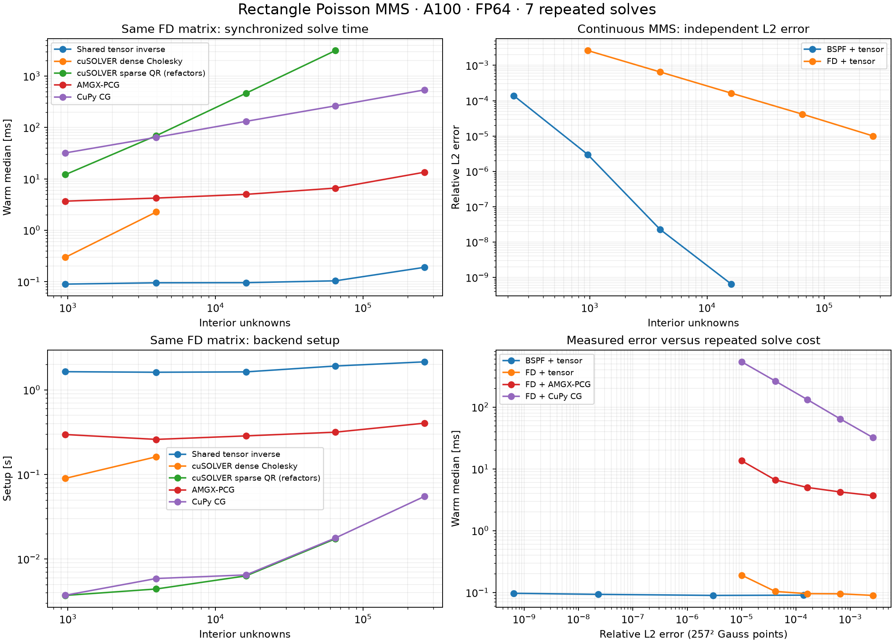

# Rectangle Poisson MMS and GPU solver comparison

Measured on 2026-09-19 on NVIDIA A100-SXM4-40GB. FP64 throughout.

## Interpretation

For the same 511² FD matrix, the reusable tensor inverse is 71.0× faster per warm solve than this AMGX-PCG configuration. Its backend setup takes 2.15 s versus 0.40 s for AMGX; reuse is essential to realizing that advantage.

The BSPF MMS convergence is much faster than second-order FD in this smooth example. Dense cuSOLVER solves on the identical BSPF matrix reproduce the same approximation errors, confirming that this difference comes from discretization rather than the linear solver.

These timings apply to a fixed, separable, constant-coefficient rectangle. They do not imply the same advantage for curved domains, variable coefficients, or repeatedly changing operators. Cold BSPF problem preparation is roughly 16 s in this implementation, including compilation and error-evaluation tables. Sparse QR's refactor-every-call cost and CuPy CG's Python overhead must be considered when interpreting their large timing differences.

## Continuous manufactured problem

Solve `-Δu=f` on `[0,2] × [0,3]`, with zero Dirichlet data. Put `t=x/2`, `s=y/3`:

```text
u = t(1-t)s(1-s) [exp(0.7t-0.4s) + 0.2 sin(5πt) cos(3πs)]
f = -∂xx u - ∂yy u
```

The forcing is evaluated from analytic product derivatives, independently of every discrete matrix. The forcing and boundary values are checked against JAX automatic differentiation. This is not a discrete manufactured RHS or a single Laplacian eigenmode.

BSPF uses degree 5, 16 spline basis functions, seven-point endpoint fits, value constraints at both endpoints, and order-8 Gauss quadrature split at nodes and knots. FD uses the standard second-order five-point operator. `n` is the number of interior unknowns per direction, so both discretizations have `n²` unknowns and `n+2` axis nodes.

Errors use an independent 257×257 Gauss grid: BSPF's own continuous interpolant versus piecewise-bilinear FD reconstruction, with the same analytic solution and quadrature weights. Nodal errors are also retained in the JSON. Thus solve error and physical approximation error are separate measurements.

## Timing contract

Each case/backend runs in a fresh process on the same GPU. Problem preparation is recorded separately; it includes axis/load assembly, first-use JAX compilation and construction of error-evaluation tables, so it is not a pure production assembly timer. Backend setup includes matrix construction/upload and reusable factorization or AMG hierarchy setup, where applicable. First solve includes solve compilation/first-use overhead. Warm solve times are medians of seven synchronized wall-clock measurements, with operator and RHS already resident. No solution download or error evaluation is timed.

- Shared tensor inverse: the production `plan_rectangle_poisson` / `solve_rectangle_poisson` API; only axis matrices are factored.
- Dense direct: CuPy `linalg.cholesky` uses cuSOLVER; repeated solves use two GPU triangular solves with the retained factor. The same full discrete matrix is used as the tensor inverse, including BSPF's nonidentity masses. Dense cases are capped at 4,096 unknowns to bound quadratic storage.
- Sparse direct: CuPy `spsolve` uses cuSOLVER `csrlsvqr`. Its API refactors on each call; **the plotted warm time includes factorization** and is not a reusable-factor solve. This baseline is capped at 255² unknowns.
- AMGX-PCG: FP64 classical AMG V-cycle, symmetric one-pre/one-post Jacobi smoothing and dense coarse solve. Every call explicitly zeros the device vector inside the timed region before solving. This avoids accumulation observed when relying on the local library's zero-initial-guess shortcut alone.
- CG: unpreconditioned CuPy GPU CG from zero. Iteration counts come from a separate untimed callback run. These wall times include Python dispatch/convergence-check overhead; they are not a claim about an optimized fused CG implementation.

Both iterative methods target relative residual `1e-10`. Every method must independently satisfy `||AU-F||₂/||F||₂ ≤ 2e-10`; no residual refinement or tolerance relaxation is applied. GPU-to-host transfers occur only outside warm timing. AMG hierarchy storage and solver workspaces are not reported as matrix storage.

## Same finite-difference matrix

| n | Tensor [ms] | Dense direct [ms] | Sparse QR† [ms] | AMGX-PCG [ms] | CG [ms] | AMG / CG iterations | Relative L2 error |
|---:|---:|---:|---:|---:|---:|---:|---:|
| 31 | 0.089 | 0.297 | 12.109 | 3.687 | 32.014 | 13 / 130 | 2.623e-03 |
| 63 | 0.095 | 2.269 | 69.346 | 4.231 | 64.437 | 14 / 262 | 6.512e-04 |
| 127 | 0.095 | — | 465.799 | 4.999 | 131.843 | 15 / 531 | 1.630e-04 |
| 255 | 0.104 | — | 3147.998 | 6.618 | 264.056 | 15 / 1067 | 4.159e-05 |
| 511 | 0.190 | — | — | 13.499 | 540.120 | 16 / 2170 | 1.003e-05 |

All methods in this table solve the same five-point FD matrix. Their L2 errors agree at the displayed precision; the error column reports the common FD discretization error against the continuous MMS, not the algebraic residual. † Sparse QR refactors each RHS. Dashes are configured size caps, not failed solves.

## BSPF versus FD approximation

| Discretization | n | Unknowns | Relative L2 error | Nodal relative error | Tensor warm [ms] | Problem preparation [s] | Tensor setup [s] |
|---|---:|---:|---:|---:|---:|---:|---:|
| BSPF | 15 | 225 | 1.379e-04 | 1.676e-04 | 0.090 | 16.110 | 1.409 |
| BSPF | 31 | 961 | 2.987e-06 | 3.547e-06 | 0.089 | 16.361 | 1.633 |
| BSPF | 63 | 3,969 | 2.295e-08 | 2.291e-08 | 0.093 | 16.340 | 1.613 |
| BSPF | 127 | 16,129 | 6.444e-10 | 7.358e-10 | 0.097 | 16.316 | 1.642 |
| FD | 31 | 961 | 2.623e-03 | 1.917e-03 | 0.089 | 0.046 | 1.643 |
| FD | 63 | 3,969 | 6.512e-04 | 4.738e-04 | 0.095 | 0.046 | 1.619 |
| FD | 127 | 16,129 | 1.630e-04 | 1.181e-04 | 0.095 | 0.047 | 1.635 |
| FD | 255 | 65,025 | 4.159e-05 | 2.951e-05 | 0.104 | 0.050 | 1.918 |
| FD | 511 | 261,121 | 1.003e-05 | 7.375e-06 | 0.190 | 0.067 | 2.149 |

## Dense direct on the identical BSPF matrix

| n | Tensor warm [ms] | Dense direct warm [ms] | Tensor setup [s] | Dense setup [s] | Tensor factors [MiB] | Dense factor alone [MiB] |
|---:|---:|---:|---:|---:|---:|---:|
| 15 | 0.090 | 0.141 | 1.409 | 0.048 | 0.005 | 0.386 |
| 31 | 0.089 | 0.298 | 1.633 | 0.095 | 0.022 | 7.046 |
| 63 | 0.093 | 2.259 | 1.613 | 0.282 | 0.091 | 120.186 |

All 28 measured cases passed the independent residual check; maximum relative residual was `1.143e-10`. All backend timings, setup/first-call timings, iteration counts, errors and AMGX configuration are in [results.json](data/rectangle_mms/results.json).



[PDF figure](data/rectangle_mms/comparison.pdf)

## Reproduce

```bash
OPENBLAS_NUM_THREADS=1 OMP_NUM_THREADS=1 PYTHONPATH=jax/src \
  python scratch/benchmark_rectangle_mms.py \
  --amgx-python /raven/u/limo/venvs/numba_cuda_waterboa/bin/python \
  --amgx-runtime-path /mpcdf/soft/SLE_15/packages/x86_64/cuda/13.2.1/lib64
python scratch/report_rectangle_mms.py
```

The main interpreter needs JAX GPU, CuPy CUDA 12, NumPy and SciPy; the report needs Matplotlib. PyAMGX runs in its existing Python 3.13 environment, with AMGX 2.5.0 built against CUDA 13.2. The JAX/CuPy environment uses JAX 0.10.0 and CuPy 14.2.0. Different CUDA toolkit versions are recorded rather than presented as identical library stacks.

Validation: `python -m pytest jax/tests/test_rectangle_mms_benchmark.py jax/tests/test_rectangle_poisson.py -q`. Per-worker logs and assembly datasets remain under `build/rectangle_mms/`.
